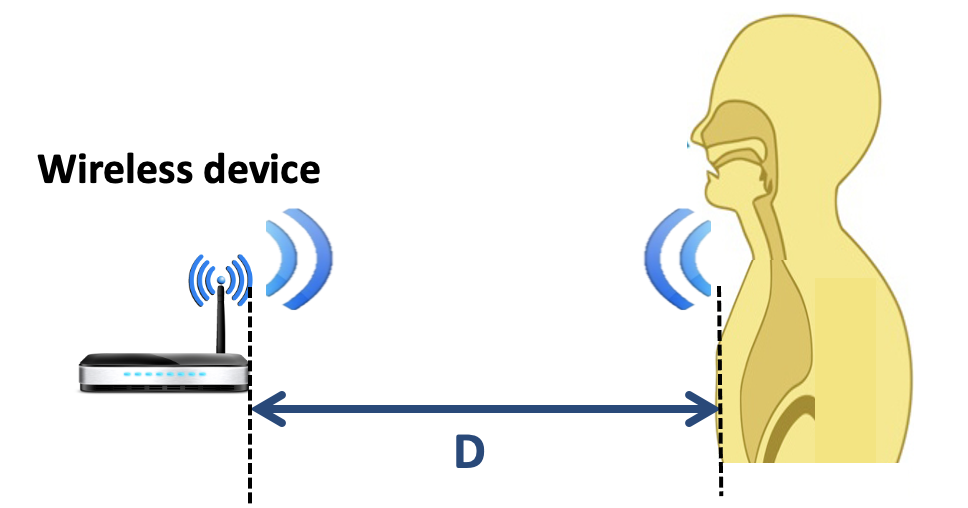

# Project 2: Breathing Rate Estimation with acoustic FMCW Signal
## Goal
* Learn how to manipulate FMCW signal that contains multiple chirps.
* Obtain distance estimates per chirp.
* Find out breathing rate of based on the distance estimates.
* Understand the limitation (resolution) of FMCW signal given the setting.

## Pre-requisite
Make sure you have successfully completed Project 2 Primer and understand how FMCW signal works. 

## Simulation Setting
You are given RX.mat which is a received FMCW signal from a wireless device to a breathing person. Note this is a simulated data. As in Project 2 Primer, the acoustic FMCW signal is transmitted from the wireless device and reaches the body and reflected back to the wireless device, thus distance traveled is 2*D where D is the one way distance from the device to the body. 
	

Also note the acoustic FMCW signal travels at 343 m/s (this is the speed of sound) and the frequency range used will be from 10kHz till 22kHz (Bandwidth of 12kH), which falls into the frequency range of sound. (Note the audible sound range is from 20Hz to 20kHz)

* You are given the following starter code.
	```MATLAB
	clear all, close all, clc
	Fs = 48000; % sampling rate in Hz
	Ts = 1/Fs; % duration of one sample
	fmin = 10000; % minimum frequency of FMCW in Hz
	B = 12000; % bandwidth of FMCW in Hz (fmax = fmin + B)
	c = 343; % speed of sound (m/s)
	chirpDuration=0.01; % duration of one sweep (one chirp) 
	K=chirpDuration*Fs; % number of samples in one chirp  
	t=(0:K-1)*Ts; % time stamps of one chirp
	experimentDuration = 60; % 60 second
	numChirps = experimentDuration/chirpDuration;

	% The following code loads RX signal collected into variable RX
	% RX signal was collected over experimentDuration (60 seconds)
	% therefore contains the numChirps (6000) chirps, which is K x numChirps samples 
	load RX.mat RX 
	
	% Initialize distance estimates as all zeros.
	distance_estimates = zeros(1, numChirps);

	% Write your own code to process signal chirp by chirp
	% For each chirp find out the distance estimation (the same process you did in Project2 Primer).
	% For each chirp, you have one data point which is distance estimation.
	% After processing all chirps (6000 in this case), you will have 6000 distance estimates.
	% Write your code to overwrite distance_estimates to correct values.  

	% Plot distance_estimates 
	figure;
	plot(1:numChirps, distance_estimates);
	xlabel('Chirps')
	ylabel('Distance estimated(m)');
	title('Distance Estimation');	 
	```

After implementing your code, answer the following questions. 

* Q1: Does the breathing starts from inhale or exhale? Why? [Put your answer here.]

* Q2: How many times did this person inhaled? Exhaled? Justify your answer. [Put your answer here.]

* Q3: How far was the biggest chest movement during the experiment time? Answer in meters. [Put your answer here.] 

* Q4: What is the size of one FFT bin in Hz? [Put your answer here]

* Q5: Note Q4 is the smallest frequency change that we can ever measure between TX and RX. What is the corresponding distance that is mapped to this frequency bin size? [Put your answer here]

* Q6: Can you distinguish an object movement (in this case chest movement) that is smaller than Q5? Why or why not? [Put your answer here.]

* Q7: Based on Q4-Q6, explain why the figure that plots the distance estimates are not increasing or decreasing smoothly, but rather it contains discrete steps/jumps. [Put your answer here.]

* Q8: This current experiment data was from simulation. Explain what would be added challenges when you process the data that is actually measured from a physical wireless device. How would you tackle such challenges? Discuss at least 2 challenges and the possible solution. [Put your answer here.]